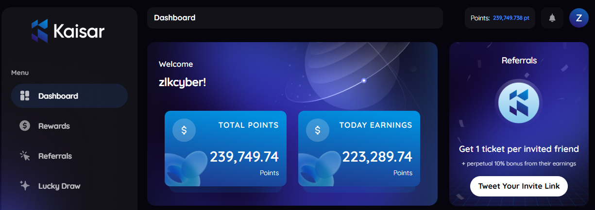

# KAISAR NETWORK

Your compute, your currency
Transform your compute power into real earnings.



### KAISAR BETA CLI MODE

**Register** : [Kaisar Network](https://zero.kaisar.io/register?ref=XqpGZZ873)

- Create your email
- Verify email
- Connect your wallet
- Done

## BOT FEATURE

- Automated Run Kaisar Node.
- Automated Register to get Access Token.
- Automated Create Extensions ID for New Accounts.
- Support Multy Accounts.
- Support Proxy.

## PREREQUISITE

- Git
- Node.js 20+

## INSTALLATION

1. Clone the repository:
   ```bash
   git clone https://github.com/elsuselamos/kaisar-network-bot.git && cd kaisar-network-bot
   ```
2. Install dependencies:
   ```bash
   npm install
   ```
3. Configure your accounts:
   ```bash
   cp -r accounts/proxy_list_tmp.js proxy.txt && cp -r accounts/tokens.txt tokens.txt && cp -r accounts/id.txt id.txt && cp -r accounts/emails.txt emails.txt
   ```
4. Configure the emails:
   ```bash
   nano emails.txt
   ```
5. Configure the proxy:
   ```bash
   nano proxy.txt
   ```
6. Register or Login to get Access Token:
   ```bash
   npm run register
   ```
7. Create Extension ID for new accounts:
   ```bash
   npm run setup
   ```
8. Additional spin feature:
   ```bash
   npm run spin
   ```
9. Run the bot:
   ```bash
   npm run start
   ```

## SETUP ACCOUNTS

**If you already have account you can create file manually**.
1. `tokens.txt`: Stores access_tokens each line 1 account.
2. `id.txt`: Stores Extension IDs each line 1 account.
3. `emails.txt`: Store email account 1 line 1 account.
4. `proxy.txt`: stores Proxy url format

   ```bash
   http://user:pass@ip:port
   ```
   each line 1 proxy.

**If you register using cli, file above auto filled, just fill `email.txt` with your email.**

## LICENSE

This project is licensed under the MIT License - see the [LICENSE](LICENSE) file for details.

---
